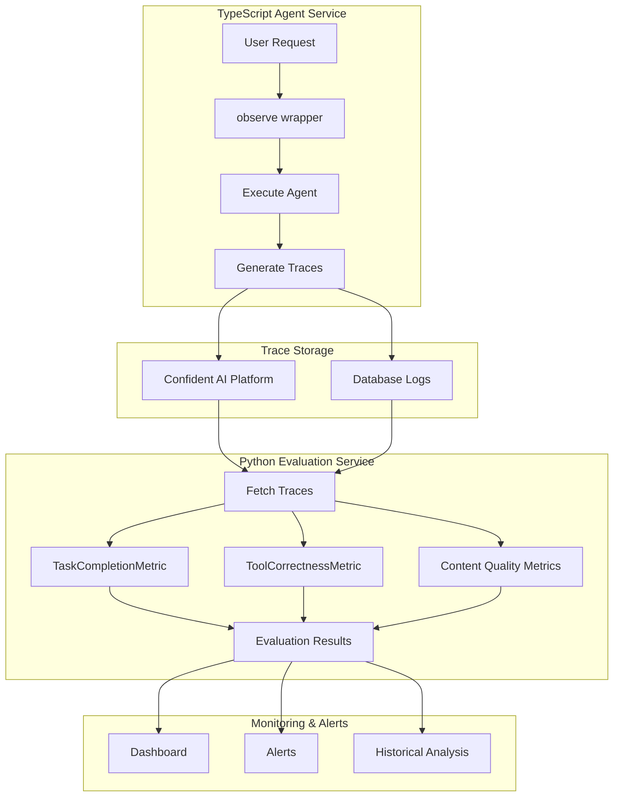

# DeepEval Architectural Approaches: Complete Guide

## Table of Contents
1. [Overview](#overview)
2. [Understanding DeepEval Metrics](#understanding-deepeval-metrics)
3. [Architectural Approaches](#architectural-approaches)
4. [Implementation Examples](#implementation-examples)
5. [Cross-Language Integration](#cross-language-integration)
6. [Best Practices & Recommendations](#best-practices--recommendations)

---

## Overview

This document provides a comprehensive guide to implementing DeepEval for agent and LLM evaluation across different architectural patterns, languages, and use cases. It covers three main approaches:

1. **Database Storage Approach** - Store agent outputs, evaluate later
2. **Python Inline Approach** - Real-time evaluation with `@observe`
3. **TypeScript Integration** - Tracing with `deepeval-ts` + Python evaluation

### Key Concepts

- **Task Completion**: Evaluates if an agent completed its intended task
- **Content Quality**: Evaluates the accuracy and quality of generated content
- **Tool Correctness**: Evaluates if agents used the right tools correctly
- **Tracing**: Capturing execution flow and component interactions

---

## Understanding DeepEval Metrics

### Available Default Metrics

DeepEval provides 40+ built-in metrics across several categories:

#### RAG Metrics
- **AnswerRelevancyMetric**: Evaluates if the generated answer is relevant to the user query
- **FaithfulnessMetric**: Measures if the generated answer is factually consistent with context
- **ContextualRelevancyMetric**: Assesses if retrieved context is relevant to the query
- **ContextualRecallMetric**: Evaluates if retrieved context contains all relevant information
- **ContextualPrecisionMetric**: Measures if retrieved context is precise and focused

#### Agentic Metrics
- **TaskCompletionMetric**: Assesses if the agent successfully completed a given task
- **ToolCorrectnessMetric**: Evaluates if tools were called and used correctly

#### Other Metrics
- **BiasMetric**, **ToxicityMetric**: Safety evaluations
- **HallucinationMetric**: Detect false information
- **GEval**: Custom LLM-as-judge metrics

### Metric Categories Explained

#### Task Completion vs Content Quality

**TaskCompletionMetric** evaluates:
- ✅ Did the agent understand the task?
- ✅ Did all expected functions run?
- ✅ Is the output structure complete?
- ❌ NOT: Is the content accurate?

**Content Quality Metrics** (Faithfulness, GEval) evaluate:
- ✅ Is the extracted data correct?
- ✅ Does reasoning make logical sense?
- ✅ Is content faithful to source material?
- ❌ NOT: Did the agent finish executing?

### Current Project Usage

Your codebase currently uses:
- **FaithfulnessMetric** - For brand content validation
- **GEval** - For custom business logic evaluation

Default metrics like AnswerRelevancyMetric aren't used because your domain (brand kit evaluation) requires specialized criteria rather than generic RAG metrics.

---

## Architectural Approaches

### Approach 1: Database Storage with Batch Evaluation

**Best for**: Production systems, historical analysis, decoupled architecture

#### Architecture Overview

```
Agent Service → Database → Evaluation Service → Results
     ↓              ↓              ↓                ↓
  Execute      Store Data    Run Metrics    Quality Scores
```

#### Database Schema

```sql
-- Agent execution logs table
CREATE TABLE agent_execution_logs (
    id INT PRIMARY KEY AUTO_INCREMENT,
    session_id VARCHAR(255) NOT NULL,
    execution_id VARCHAR(255) UNIQUE,
    step_number INT,
    task_description TEXT,
    input_data JSON,
    output_data JSON,
    tools_called JSON,
    tool_inputs JSON,
    tool_outputs JSON,
    expected_outcome TEXT,
    actual_outcome TEXT,
    execution_duration FLOAT,
    error_message TEXT,
    timestamp DATETIME DEFAULT CURRENT_TIMESTAMP,
    agent_id VARCHAR(255),
    agent_version VARCHAR(50),
    INDEX idx_session (session_id),
    INDEX idx_timestamp (timestamp),
    INDEX idx_agent (agent_id)
);

-- Evaluation results table
CREATE TABLE evaluation_results (
    id INT PRIMARY KEY AUTO_INCREMENT,
    execution_id VARCHAR(255),
    metric_name VARCHAR(100),
    score FLOAT,
    passed BOOLEAN,
    reason TEXT,
    threshold FLOAT,
    metadata JSON,
    evaluated_at DATETIME DEFAULT CURRENT_TIMESTAMP,
    FOREIGN KEY (execution_id) REFERENCES agent_execution_logs(execution_id)
);
```

#### Implementation Example

**Agent Service (TypeScript/Python):**
```typescript
// TypeScript Agent Service
interface AgentExecutionLogger {
  async logExecution(
    sessionId: string,
    task: string,
    toolsUsed: ToolCall[],
    result: any
  ): Promise<void>;
}

class AgentService {
  private logger: AgentExecutionLogger;
  
  async executeBrandAnalysis(websiteUrl: string): Promise<BrandKit> {
    const sessionId = generateSessionId();
    const startTime = Date.now();
    
    try {
      // Execute agent logic
      const scrapedContent = await this.scrapeWebsite(websiteUrl);
      const brandData = await this.extractBrandInfo(scrapedContent);
      const competitors = await this.analyzeCompetitors(brandData);
      
      const result = {
        brandData,
        competitors,
        rawContent: scrapedContent
      };
      
      // Log execution for batch evaluation
      await this.logger.logExecution(sessionId, "brand_analysis", [
        { name: "scrapeWebsite", input: { url: websiteUrl }, output: scrapedContent },
        { name: "extractBrandInfo", input: { content: scrapedContent }, output: brandData },
        { name: "analyzeCompetitors", input: { brandData }, output: competitors }
      ], result);
      
      return result;
    } catch (error) {
      await this.logger.logError(sessionId, error);
      throw error;
    }
  }
}
```

**Evaluation Service (Python - Current Repository):**
```python
# src/evaluation/agent_evaluator.py
from typing import List, Dict, Any
from deepeval import evaluate
from deepeval.metrics import TaskCompletionMetric, ToolCorrectnessMetric
from deepeval.test_case import LLMTestCase, ToolCall
from src.database.connection import db

class AgentEvaluationService:
    """Batch evaluation service for agent executions"""
    
    async def evaluate_agent_sessions(
        self, 
        session_ids: List[str] = None,
        time_range: tuple = None
    ) -> List[Dict[str, Any]]:
        """
        Evaluate agent sessions from database
        
        Args:
            session_ids: Specific sessions to evaluate
            time_range: (start_date, end_date) tuple for batch evaluation
        """
        # Fetch execution logs from database
        if session_ids:
            logs = await db.agent_execution_logs.find_many(
                where={'session_id': {'in': session_ids}}
            )
        elif time_range:
            logs = await db.agent_execution_logs.find_many(
                where={
                    'timestamp': {
                        'gte': time_range[0],
                        'lte': time_range[1]
                    }
                }
            )
        else:
            # Default: last 24 hours
            logs = await self._get_recent_logs()
        
        # Group logs by session
        sessions = self._group_by_session(logs)
        results = []
        
        for session_id, session_logs in sessions.items():
            # Evaluate task completion
            task_result = await self._evaluate_task_completion(session_logs)
            results.append(task_result)
            
            # Evaluate tool correctness
            tool_result = await self._evaluate_tool_correctness(session_logs)
            results.append(tool_result)
            
            # Evaluate content quality (existing implementation)
            content_result = await self._evaluate_content_quality(session_logs)
            results.append(content_result)
            
            # Store results
            await self._save_evaluation_results(session_id, [
                task_result, tool_result, content_result
            ])
        
        return results
    
    async def _evaluate_task_completion(
        self, 
        session_logs: List[Dict]
    ) -> Dict[str, Any]:
        """Evaluate if agent completed its task"""
        # Reconstruct execution flow from logs
        task_description = session_logs[0]['task_description']
        final_output = session_logs[-1]['output_data']
        
        # Create test case from logs
        test_case = LLMTestCase(
            input=task_description,
            actual_output=str(final_output)
        )
        
        # Evaluate with TaskCompletionMetric
        # Note: TaskCompletionMetric typically needs traces,
        # but we can approximate with structured logs
        metric = TaskCompletionMetric(threshold=0.8)
        
        # For actual implementation, you'd need to reconstruct
        # the trace structure from your logs
        score = await self._calculate_task_completion_score(session_logs)
        
        return {
            "metric": "TaskCompletion",
            "score": score,
            "passed": score >= 0.8,
            "session_id": session_logs[0]['session_id']
        }
    
    async def _evaluate_tool_correctness(
        self, 
        session_logs: List[Dict]
    ) -> Dict[str, Any]:
        """Evaluate if tools were used correctly"""
        tools_called = []
        expected_tools = []
        
        for log in session_logs:
            if log['tools_called']:
                for tool in log['tools_called']:
                    tools_called.append(
                        ToolCall(
                            name=tool['name'],
                            input_parameters=tool['input'],
                            output=tool['output']
                        )
                    )
        
        # Define expected tools based on task
        task = session_logs[0]['task_description']
        if 'brand_analysis' in task:
            expected_tools = [
                ToolCall(name="scrapeWebsite"),
                ToolCall(name="extractBrandInfo"),
                ToolCall(name="analyzeCompetitors")
            ]
        
        test_case = LLMTestCase(
            input=task,
            actual_output=str(session_logs[-1]['output_data']),
            tools_called=tools_called,
            expected_tools=expected_tools
        )
        
        metric = ToolCorrectnessMetric(
            threshold=0.9,
            should_consider_ordering=True
        )
        
        await metric.a_measure(test_case)
        
        return {
            "metric": "ToolCorrectness",
            "score": metric.score,
            "passed": metric.is_successful(),
            "reason": metric.reason if hasattr(metric, 'reason') else None
        }
    
    async def _evaluate_content_quality(
        self,
        session_logs: List[Dict]
    ) -> Dict[str, Any]:
        """Evaluate content quality using existing evaluators"""
        # Extract brand kit data and raw content
        final_output = session_logs[-1]['output_data']
        raw_content = next(
            (log['output_data'] for log in session_logs 
             if log['tools_called'] and 
             any(t['name'] == 'scrapeWebsite' for t in log['tools_called'])),
            ""
        )
        
        # Use existing content evaluators
        from src.evaluation.content_faithfulness import ContentFaithfulnessEvaluator
        
        evaluator = ContentFaithfulnessEvaluator()
        results = await evaluator.evaluate(
            brand_kit_data=final_output.get('brandData', {}),
            raw_jason=raw_content
        )
        
        # Aggregate scores
        avg_score = sum(r['score'] for r in results) / len(results) if results else 0
        
        return {
            "metric": "ContentQuality",
            "score": avg_score,
            "passed": avg_score >= 0.7,
            "details": results
        }
```

#### Advantages & Disadvantages

**Advantages:**
- ✅ No runtime performance impact on agents
- ✅ Complete execution history for debugging
- ✅ Can re-evaluate with new metrics
- ✅ Supports batch processing and scheduling
- ✅ Clean separation of concerns

**Disadvantages:**
- ❌ Delayed feedback (not real-time)
- ❌ Requires additional infrastructure (database, scheduler)
- ❌ More complex initial setup

---

### Approach 2: Python Inline Evaluation with @observe

**Best for**: Development, testing, real-time monitoring

#### Architecture Overview

```
@observe → Execute Agent → Trace Collection → Immediate Evaluation
    ↓           ↓              ↓                    ↓
Decorator   Function     Auto-capture         Metrics Run
```

#### Implementation Example

```python
# Python Agent with Real-time Evaluation
from deepeval.metrics import TaskCompletionMetric, ToolCorrectnessMetric
from deepeval.tracing import observe, update_current_span
from deepeval.test_case import LLMTestCase
from deepeval import evaluate
from deepeval.dataset import Golden

# Initialize metrics
task_completion = TaskCompletionMetric(
    threshold=0.8,
    model="gpt-4",
    include_reason=True
)

@observe(metrics=[task_completion])  # Automatic task evaluation
def brand_analysis_agent(website_url: str) -> dict:
    """
    Main agent function with automatic task completion evaluation
    """
    
    @observe()  # Trace sub-component
    def scrape_website(url: str) -> str:
        """Scrape website content"""
        import requests
        from bs4 import BeautifulSoup
        
        response = requests.get(url)
        soup = BeautifulSoup(response.text, 'html.parser')
        
        # Extract relevant content
        content = {
            "title": soup.find('title').text if soup.find('title') else "",
            "description": soup.find('meta', {'name': 'description'})['content'] 
                          if soup.find('meta', {'name': 'description'}) else "",
            "headings": [h.text for h in soup.find_all(['h1', 'h2'])],
            "paragraphs": [p.text for p in soup.find_all('p')[:5]]
        }
        
        # Update span with additional info
        update_current_span(
            attributes={
                "url": url,
                "content_length": len(str(content)),
                "status_code": response.status_code
            }
        )
        
        return str(content)
    
    @observe()  # Trace LLM call
    def extract_brand_info(content: str) -> dict:
        """Extract brand information using LLM"""
        from openai import OpenAI
        
        client = OpenAI()
        response = client.chat.completions.create(
            model="gpt-4",
            messages=[
                {"role": "system", "content": "Extract brand information from website content"},
                {"role": "user", "content": f"Extract brand data from: {content}"}
            ]
        )
        
        brand_data = {
            "name": "Nike",  # Parsed from response
            "tagline": "Just Do It",
            "industry": "Athletic footwear and apparel",
            "values": ["Innovation", "Performance", "Sustainability"]
        }
        
        # Update span for metrics
        update_current_span(
            test_case=LLMTestCase(
                input=content[:500],
                actual_output=str(brand_data)
            )
        )
        
        return brand_data
    
    @observe()  # Trace retrieval/analysis
    def analyze_competitors(brand_data: dict) -> list:
        """Analyze and identify competitors"""
        # Competitor analysis logic
        competitors = [
            {"name": "Adidas", "reason": "Direct competitor in athletic footwear"},
            {"name": "Under Armour", "reason": "Performance athletic wear"},
            {"name": "Puma", "reason": "Sports lifestyle brand"}
        ]
        
        update_current_span(
            attributes={
                "brand_name": brand_data.get("name"),
                "competitors_found": len(competitors)
            }
        )
        
        return competitors
    
    # Agent workflow execution
    try:
        content = scrape_website(website_url)
        brand_data = extract_brand_info(content)
        competitors = analyze_competitors(brand_data)
        
        result = {
            "brand_data": brand_data,
            "competitors": competitors,
            "raw_content": content
        }
        
        # Store in database for additional evaluation
        save_to_database(result)
        
        return result
        
    except Exception as e:
        update_current_span(
            attributes={"error": str(e), "failed": True}
        )
        raise

# Evaluate the agent
def run_agent_evaluation():
    """Run agent with evaluation"""
    
    # Method 1: Direct execution (traces automatically)
    result = brand_analysis_agent("https://nike.com")
    print(f"Agent result: {result}")
    
    # Method 2: Using evaluate() for batch testing
    test_results = evaluate(
        observed_callback=brand_analysis_agent,
        goldens=[
            Golden(input="https://nike.com"),
            Golden(input="https://adidas.com"),
            Golden(input="https://apple.com")
        ]
    )
    
    # Results include TaskCompletionMetric scores
    for result in test_results:
        print(f"""
        Test: {result['test_name']}
        Success: {result['success']}
        Task Completion Score: {result['metrics'][0]['score']}
        Reason: {result['metrics'][0]['reason']}
        """)

# Additional content quality evaluation
def evaluate_content_quality(agent_output: dict):
    """
    Separate evaluation for content quality
    (Run after agent execution)
    """
    from deepeval.metrics import FaithfulnessMetric, GEval
    from deepeval.test_case import LLMTestCase, LLMTestCaseParams
    
    # Test 1: Brand data faithfulness
    brand_test = LLMTestCase(
        input="Brand extraction from Nike website",
        actual_output=str(agent_output['brand_data']),
        retrieval_context=[agent_output['raw_content']]
    )
    
    faithfulness = FaithfulnessMetric(
        threshold=0.8,
        model="gpt-4"
    )
    faithfulness.measure(brand_test)
    
    print(f"Faithfulness Score: {faithfulness.score}")
    print(f"Is Nike data faithful to source? {faithfulness.is_successful()}")
    
    # Test 2: Competitor reasoning quality
    for competitor in agent_output['competitors']:
        competitor_test = LLMTestCase(
            input=f"Evaluate competitor reasoning for {competitor['name']}",
            actual_output=competitor['reason']
        )
        
        reasoning_quality = GEval(
            name="Competitor Reasoning Quality",
            criteria="Is the competitor reasoning logical, relevant, and well-justified?",
            evaluation_params=[LLMTestCaseParams.ACTUAL_OUTPUT],
            threshold=0.7
        )
        
        reasoning_quality.measure(competitor_test)
        print(f"{competitor['name']} reasoning score: {reasoning_quality.score}")

# Example: What gets traced and evaluated
"""
Trace Structure Created:
{
    "trace_id": "abc123",
    "name": "brand_analysis_agent",
    "input": {"website_url": "https://nike.com"},
    "output": {
        "brand_data": {...},
        "competitors": [...],
        "raw_content": "..."
    },
    "spans": [
        {
            "span_id": "span1",
            "name": "scrape_website",
            "attributes": {
                "url": "https://nike.com",
                "content_length": 5420,
                "status_code": 200
            },
            "duration": 1.2
        },
        {
            "span_id": "span2",
            "name": "extract_brand_info",
            "test_case": {...},
            "duration": 2.3
        },
        {
            "span_id": "span3",
            "name": "analyze_competitors",
            "attributes": {
                "brand_name": "Nike",
                "competitors_found": 3
            },
            "duration": 0.8
        }
    ],
    "metrics": [
        {
            "name": "TaskCompletionMetric",
            "score": 0.92,
            "success": true,
            "reason": "Agent successfully completed brand analysis..."
        }
    ]
}
"""
```

#### What TaskCompletionMetric Actually Evaluates

```python
# Behind the scenes, TaskCompletionMetric sends this to LLM:
prompt = """
Given this agent execution trace:
- Agent Name: brand_analysis_agent
- Input: https://nike.com
- Function calls: scrape_website → extract_brand_info → analyze_competitors
- Final output: {brand_data: {...}, competitors: [...]}

DETERMINE:
1. What was the intended task based on the input and function names?
2. Was this task completed successfully based on the output?
3. Rate completion from 0-1

Response format:
{
    "inferred_task": "...",
    "task_completed": true/false,
    "score": 0.0-1.0,
    "reason": "..."
}
"""

# LLM evaluates and returns:
{
    "inferred_task": "Analyze the Nike brand by scraping their website, extracting brand information, and identifying competitors",
    "task_completed": true,
    "score": 0.92,
    "reason": "The agent successfully scraped website content, extracted structured brand data, and identified relevant competitors. All expected outputs are present."
}
```

#### Advantages & Disadvantages

**Advantages:**
- ✅ Real-time feedback during execution
- ✅ Automatic trace collection
- ✅ Rich context for debugging
- ✅ No manual logging required

**Disadvantages:**
- ❌ Performance impact (adds latency)
- ❌ Couples evaluation with business logic
- ❌ Python-only solution

---

### Approach 3: TypeScript Agent with DeepEval Integration

**Best for**: TypeScript/JavaScript agents with Python evaluation

#### Architecture Overview

```
TypeScript Agent → Traces → Confident AI/Database → Python Evaluation
       ↓             ↓              ↓                      ↓
observe wrapper  Auto-send    Store traces         Run metrics
```

#### TypeScript Implementation

```typescript
// Install: npm install deepeval-ts

import { 
  observe, 
  updateCurrentSpanAttributes,
  init as initDeepEval 
} from "deepeval-ts/tracing";

// Initialize DeepEval (reads CONFIDENT_API_KEY from env)
initDeepEval();

// Define types
interface BrandData {
  name: string;
  tagline: string;
  industry: string;
  founded?: string;
  values: string[];
}

interface Competitor {
  name: string;
  reason: string;
  similarity_score?: number;
}

interface AgentResult {
  brandData: BrandData;
  competitors: Competitor[];
  metadata?: {
    executionTime: number;
    tokensUsed: number;
  };
}

// Main agent with tracing
const brandAnalysisAgent = observe({
  type: "agent",
  name: "brand_analysis_agent",
  fn: async (websiteUrl: string): Promise<AgentResult> => {
    
    // Tool 1: Web Scraper
    const scrapeWebsite = observe({
      type: "tool",
      name: "web_scraper",
      fn: async (url: string): Promise<string> => {
        const response = await fetch(url);
        const html = await response.text();
        
        // Parse HTML with cheerio or similar
        const $ = cheerio.load(html);
        const content = {
          title: $('title').text(),
          description: $('meta[name="description"]').attr('content'),
          headings: $('h1, h2').map((_, el) => $(el).text()).get(),
          paragraphs: $('p').slice(0, 5).map((_, el) => $(el).text()).get()
        };
        
        // Update span attributes
        updateCurrentSpanAttributes({
          url,
          contentLength: html.length,
          statusCode: response.status
        });
        
        return JSON.stringify(content);
      }
    });
    
    // Tool 2: LLM Brand Extractor
    const extractBrandInfo = observe({
      type: "llm",
      model: "gpt-4",
      fn: async (content: string): Promise<BrandData> => {
        const response = await openai.chat.completions.create({
          model: "gpt-4",
          messages: [
            {
              role: "system",
              content: "Extract brand information from website content. Return JSON."
            },
            {
              role: "user",
              content: `Extract brand data from: ${content}`
            }
          ],
          response_format: { type: "json_object" }
        });
        
        const brandData = JSON.parse(response.choices[0].message.content);
        
        // Update span with token usage
        updateCurrentSpanAttributes({
          input: content.substring(0, 100),
          output: JSON.stringify(brandData),
          inputTokenCount: response.usage?.prompt_tokens,
          outputTokenCount: response.usage?.completion_tokens,
          totalTokenCount: response.usage?.total_tokens
        });
        
        return brandData;
      }
    });
    
    // Tool 3: Competitor Analyzer (RAG)
    const analyzeCompetitors = observe({
      type: "retriever",
      name: "competitor_analyzer",
      fn: async (brandData: BrandData): Promise<Competitor[]> => {
        // Vector database query
        const embedding = await createEmbedding(brandData.name + " " + brandData.industry);
        const similarCompanies = await vectorDB.query({
          vector: embedding,
          topK: 5,
          filter: { industry: brandData.industry }
        });
        
        // LLM to analyze and rank competitors
        const competitors = await Promise.all(
          similarCompanies.map(async (company) => {
            const reason = await generateCompetitorReason(brandData, company);
            return {
              name: company.name,
              reason,
              similarity_score: company.score
            };
          })
        );
        
        // Update retriever span
        updateCurrentSpanAttributes({
          embeddingInput: `${brandData.name} ${brandData.industry}`,
          retrievalContext: competitors.map(c => c.name),
          retrievalCount: competitors.length
        });
        
        return competitors;
      }
    });
    
    // Execute agent workflow
    const startTime = Date.now();
    
    try {
      const htmlContent = await scrapeWebsite(websiteUrl);
      const brandData = await extractBrandInfo(htmlContent);
      const competitors = await analyzeCompetitors(brandData);
      
      const result: AgentResult = {
        brandData,
        competitors,
        metadata: {
          executionTime: Date.now() - startTime,
          tokensUsed: 0 // Calculate from spans
        }
      };
      
      // Store in database for batch evaluation
      await storeAgentExecution({
        sessionId: generateSessionId(),
        websiteUrl,
        result,
        traces: "auto-captured" // DeepEval handles this
      });
      
      return result;
      
    } catch (error) {
      updateCurrentSpanAttributes({
        error: error.message,
        failed: true
      });
      throw error;
    }
  }
});

// Usage
async function main() {
  try {
    const result = await brandAnalysisAgent("https://nike.com");
    console.log("Brand analysis completed:", result);
    
    // Traces are automatically sent to Confident AI
    // Evaluation happens in Python service
    
  } catch (error) {
    console.error("Agent failed:", error);
  }
}

// Advanced: Custom span types
const customPipeline = observe({
  type: "custom",
  name: "brand_enrichment_pipeline",
  fn: async (brandData: BrandData) => {
    // Nested spans for complex workflows
    const socialMediaData = await fetchSocialMedia(brandData.name);
    const newsArticles = await fetchNews(brandData.name);
    const enrichedData = await enrichBrandData(brandData, socialMediaData, newsArticles);
    
    updateCurrentSpanAttributes({
      enrichmentSources: ["social", "news"],
      dataPointsAdded: Object.keys(enrichedData).length
    });
    
    return enrichedData;
  }
});

// What gets traced automatically:
interface TraceData {
  trace_id: string;
  name: "brand_analysis_agent";
  input: { websiteUrl: string };
  output: AgentResult;
  spans: Array<{
    type: "tool" | "llm" | "retriever" | "custom";
    name: string;
    input: any;
    output: any;
    attributes: Record<string, any>;
    duration: number;
    timestamp: string;
  }>;
  total_duration: number;
  total_tokens?: number;
}
```

#### Python Evaluation Service for TypeScript Agents

```python
# src/evaluation/typescript_agent_evaluator.py
import os
from typing import List, Dict, Any
from deepeval import evaluate
from deepeval.metrics import TaskCompletionMetric, ToolCorrectnessMetric
from deepeval.test_case import LLMTestCase, ToolCall
from confident_ai import ConfidentAI
import asyncio

class TypeScriptAgentEvaluator:
    """
    Evaluates TypeScript agents using traces from Confident AI
    """
    
    def __init__(self):
        self.client = ConfidentAI(api_key=os.getenv("CONFIDENT_API_KEY"))
        
    async def evaluate_typescript_agents(
        self,
        agent_name: str = "brand_analysis_agent",
        time_range: tuple = None
    ) -> List[Dict[str, Any]]:
        """
        Fetch and evaluate TypeScript agent traces
        """
        # Fetch traces from Confident AI
        traces = self.client.get_traces(
            agent_name=agent_name,
            start_time=time_range[0] if time_range else None,
            end_time=time_range[1] if time_range else None,
            limit=100
        )
        
        results = []
        
        for trace in traces:
            # Evaluate task completion
            task_result = await self._evaluate_task_from_trace(trace)
            results.append(task_result)
            
            # Evaluate tool usage
            tool_result = await self._evaluate_tools_from_trace(trace)
            results.append(tool_result)
            
            # Evaluate content quality
            content_result = await self._evaluate_content_from_trace(trace)
            results.append(content_result)
            
        return results
    
    async def _evaluate_task_from_trace(self, trace: Dict) -> Dict[str, Any]:
        """
        Evaluate task completion from TypeScript trace
        """
        # TaskCompletionMetric can work directly with traces
        metric = TaskCompletionMetric(
            threshold=0.8,
            model="gpt-4",
            include_reason=True
        )
        
        # Create a pseudo test case from trace
        test_case = LLMTestCase(
            input=str(trace['input']),
            actual_output=str(trace['output'])
        )
        
        # The metric will analyze the trace structure
        await metric.a_measure(test_case, trace=trace)
        
        return {
            "trace_id": trace['trace_id'],
            "metric": "TaskCompletion",
            "score": metric.score,
            "passed": metric.is_successful(),
            "reason": metric.reason,
            "agent": trace['name']
        }
    
    async def _evaluate_tools_from_trace(self, trace: Dict) -> Dict[str, Any]:
        """
        Evaluate tool correctness from TypeScript trace
        """
        # Extract tool calls from spans
        tools_called = []
        for span in trace.get('spans', []):
            if span['type'] == 'tool':
                tools_called.append(
                    ToolCall(
                        name=span['name'],
                        input_parameters=span.get('input', {}),
                        output=span.get('output', "")
                    )
                )
        
        # Define expected tools based on agent
        expected_tools = [
            ToolCall(name="web_scraper"),
            ToolCall(name="gpt-4"),  # LLM spans count as tools
            ToolCall(name="competitor_analyzer")
        ]
        
        test_case = LLMTestCase(
            input=str(trace['input']),
            actual_output=str(trace['output']),
            tools_called=tools_called,
            expected_tools=expected_tools
        )
        
        metric = ToolCorrectnessMetric(
            threshold=0.9,
            should_consider_ordering=True
        )
        
        await metric.a_measure(test_case)
        
        return {
            "trace_id": trace['trace_id'],
            "metric": "ToolCorrectness",
            "score": metric.score,
            "passed": metric.is_successful(),
            "tools_used": len(tools_called),
            "tools_expected": len(expected_tools)
        }
    
    async def _evaluate_content_from_trace(self, trace: Dict) -> Dict[str, Any]:
        """
        Evaluate content quality from trace output
        """
        output = trace.get('output', {})
        
        # Extract scraped content from web_scraper span
        raw_content = ""
        for span in trace.get('spans', []):
            if span['name'] == 'web_scraper':
                raw_content = span.get('output', "")
                break
        
        # Use existing content evaluators
        from src.evaluation.content_faithfulness import ContentFaithfulnessEvaluator
        
        evaluator = ContentFaithfulnessEvaluator()
        results = await evaluator.evaluate(
            brand_kit_data=output.get('brandData', {}),
            raw_jason=raw_content
        )
        
        avg_score = sum(r['score'] for r in results) / len(results) if results else 0
        
        return {
            "trace_id": trace['trace_id'],
            "metric": "ContentFaithfulness",
            "score": avg_score,
            "passed": avg_score >= 0.7,
            "details": results
        }

# Scheduled evaluation job
async def run_scheduled_evaluation():
    """
    Scheduled job to evaluate TypeScript agents
    """
    evaluator = TypeScriptAgentEvaluator()
    
    # Evaluate last hour's executions
    from datetime import datetime, timedelta
    
    end_time = datetime.now()
    start_time = end_time - timedelta(hours=1)
    
    results = await evaluator.evaluate_typescript_agents(
        agent_name="brand_analysis_agent",
        time_range=(start_time, end_time)
    )
    
    # Process results
    for result in results:
        if not result['passed']:
            # Alert on failures
            await send_alert(f"Agent evaluation failed: {result}")
    
    # Store results
    await store_evaluation_results(results)
    
    return results

# Run evaluation
if __name__ == "__main__":
    asyncio.run(run_scheduled_evaluation())
```

---

## Cross-Language Integration

### Complete Architecture Flow



### Integration Configuration

```yaml
# docker-compose.yml for complete system
version: '3.8'

services:
  # TypeScript Agent Service
  agent-service:
    build: ./agent-service
    environment:
      - CONFIDENT_API_KEY=${CONFIDENT_API_KEY}
      - OPENAI_API_KEY=${OPENAI_API_KEY}
      - DATABASE_URL=mysql://user:pass@db:3306/agents
    ports:
      - "3000:3000"
    depends_on:
      - db

  # Python Evaluation Service
  evaluation-service:
    build: ./evaluation-service
    environment:
      - CONFIDENT_API_KEY=${CONFIDENT_API_KEY}
      - OPENAI_API_KEY=${OPENAI_API_KEY}
      - DATABASE_URL=mysql://user:pass@db:3306/agents
    depends_on:
      - db
      - redis

  # Scheduled Evaluation Jobs
  evaluation-scheduler:
    build: ./evaluation-service
    command: python -m src.schedulers.evaluation_scheduler
    environment:
      - CONFIDENT_API_KEY=${CONFIDENT_API_KEY}
      - EVALUATION_SCHEDULE="*/30 * * * *"  # Every 30 minutes
    depends_on:
      - evaluation-service
      - redis

  # Database
  db:
    image: mysql:8.0
    environment:
      - MYSQL_ROOT_PASSWORD=root
      - MYSQL_DATABASE=agents
    volumes:
      - mysql_data:/var/lib/mysql
    ports:
      - "3306:3306"

  # Cache for evaluation results
  redis:
    image: redis:alpine
    ports:
      - "6379:6379"

volumes:
  mysql_data:
```

---

## Best Practices & Recommendations

### Choosing the Right Approach

| Scenario | Recommended Approach | Reasoning |
|----------|---------------------|-----------|
| **Production TypeScript Agents** | Database + Batch Evaluation | Clean separation, no performance impact |
| **Python Agent Development** | Inline @observe | Real-time feedback, easy debugging |
| **Mixed Language Systems** | TypeScript observe + Python Evaluation | Leverage best of both ecosystems |
| **High-Volume Production** | Database Storage | Scalable batch processing |
| **Real-time Critical Systems** | Hybrid (inline for critical, batch for rest) | Balance performance and monitoring |

### Implementation Checklist

#### For Database Approach:
- [ ] Design database schema for agent logs
- [ ] Implement logging in agent service
- [ ] Create evaluation service with DeepEval metrics
- [ ] Set up scheduled evaluation jobs
- [ ] Configure monitoring and alerts
- [ ] Implement result storage and visualization

#### For Python Inline:
- [ ] Install DeepEval: `pip install deepeval`
- [ ] Add @observe decorators to agent functions
- [ ] Configure metrics (TaskCompletion, ToolCorrectness)
- [ ] Set up Confident AI API key
- [ ] Implement content quality evaluations
- [ ] Create test datasets with Golden records

#### For TypeScript Integration:
- [ ] Install deepeval-ts: `npm install deepeval-ts`
- [ ] Wrap agent functions with observe()
- [ ] Configure CONFIDENT_API_KEY
- [ ] Implement Python evaluation service
- [ ] Set up trace fetching from Confident AI
- [ ] Create evaluation scheduling

### Performance Considerations

1. **Inline Evaluation Impact**:
   - TaskCompletionMetric: +200-500ms per execution
   - ToolCorrectnessMetric: +50-100ms (no LLM calls)
   - Content Quality Metrics: +500-2000ms (multiple LLM calls)

2. **Batch Evaluation Efficiency**:
   - Process 1000 agent executions in ~5-10 minutes
   - Parallelize evaluation with async/await
   - Cache evaluation results for re-analysis

3. **Trace Storage**:
   - Each trace: ~5-50KB depending on complexity
   - Retention policy: Keep detailed traces for 30 days
   - Archive summaries for long-term analysis

### Security Considerations

1. **API Key Management**:
   ```bash
   # Use environment variables
   export CONFIDENT_API_KEY="your-key"
   export OPENAI_API_KEY="your-key"
   
   # Never commit keys to repository
   echo "CONFIDENT_API_KEY" >> .gitignore
   ```

2. **Data Privacy**:
   - Sanitize PII from traces before evaluation
   - Use on-premise deployment for sensitive data
   - Implement role-based access for evaluation results

3. **Rate Limiting**:
   - Implement exponential backoff for API calls
   - Cache evaluation results to reduce API usage
   - Use batch evaluation during off-peak hours

### Monitoring & Alerting

```python
# Example monitoring setup
class EvaluationMonitor:
    def __init__(self):
        self.alert_thresholds = {
            "task_completion": 0.7,
            "tool_correctness": 0.9,
            "content_quality": 0.6
        }
    
    async def check_metrics(self, results: List[Dict]):
        for result in results:
            metric_name = result['metric']
            score = result['score']
            
            if score < self.alert_thresholds.get(metric_name, 0.5):
                await self.send_alert({
                    "severity": "high" if score < 0.3 else "medium",
                    "metric": metric_name,
                    "score": score,
                    "trace_id": result.get('trace_id'),
                    "message": f"{metric_name} below threshold: {score:.2f}"
                })
    
    async def send_alert(self, alert: Dict):
        # Implement alerting (Slack, PagerDuty, email, etc.)
        pass
```

### Common Pitfalls & Solutions

| Pitfall | Solution |
|---------|----------|
| **Evaluating task completion without context** | Include comprehensive input/output in test cases |
| **Coupling evaluation too tightly with business logic** | Use separate evaluation service or async jobs |
| **Not handling evaluation failures** | Implement try/catch and fallback evaluation |
| **Ignoring trace size limits** | Truncate large outputs, store full data separately |
| **Running expensive evaluations synchronously** | Use batch processing and async evaluation |

### Future Enhancements

1. **A/B Testing Framework**:
   - Compare different agent versions
   - Statistical significance testing
   - Automatic rollback on performance degradation

2. **Custom Metrics Development**:
   - Domain-specific evaluation criteria
   - Business KPI alignment
   - Cost-per-quality optimization

3. **Real-time Dashboard**:
   - Live agent performance monitoring
   - Trace visualization
   - Anomaly detection

---

## Summary

This document provides a comprehensive guide to implementing DeepEval for agent evaluation across different architectures and languages. The key takeaways are:

1. **Use Database Storage** for production systems requiring scalability and historical analysis
2. **Use Python @observe** for development and real-time monitoring
3. **Use TypeScript observe wrappers** with Python evaluation for cross-language systems
4. **Understand the difference** between task completion and content quality metrics
5. **Implement proper monitoring** and alerting for production systems

The choice of approach depends on your specific requirements, but the hybrid approach (TypeScript tracing + Python evaluation + database storage) provides the most flexibility and scalability for production systems.

---

## References

- [DeepEval Documentation](https://deepeval.com/docs)
- [Confident AI Platform](https://confident-ai.com)
- [DeepEval GitHub Repository](https://github.com/confident-ai/deepeval)
- [TypeScript Integration Guide](https://documentation.confident-ai.com/llm-observability/integrations/typescript)
- [LLM Evaluation Best Practices](https://www.confident-ai.com/blog/llm-evaluation-metrics-everything-you-need-for-llm-evaluation)